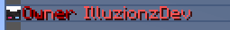
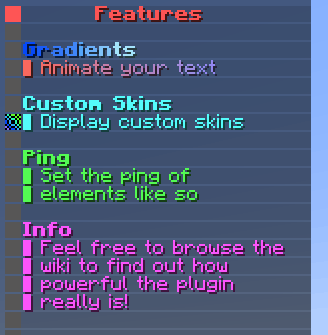
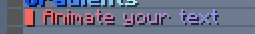
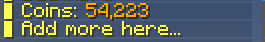

# Configuration
This page has extensive information on how to configure the different aspects of the plugin. All default files
in the plugin come with thorough comments to help get you started configuring. This page will break down
the sections of the config for more in-depth of what they do and help. Some text may have annotations
you can click on for more info, others may have comments that you can also read. To just view default files view [here](../default-files).

## Main Config
The first file to look over is the main file `config.yml`. This just contains basic options
that apply throughout the plugin.

``` yaml title="config.yml" linenums="1" 
settings:
    # The language file to use for the plugin
    # More language files (if available) can be found in the plugins locale folder.
    locale: en_US # (1)

tab:
    # The default tab to show players if
    # they don't meet any requirements
    default: default # (2)
```

1.  This is the locale file to use for the plugin. It can be found
    in `locales`.

2.  This is the default tab to display (taken from /tabs) when a player
    doesn't meet any of the requirements for any tab.

## Custom Skins
This plugin has the ability to display custom skins in tab elements. They are
defined by a value and a signature. Custom skins can be defined in the [`skins.yml`](../default-files) file
by name where you can reference them later in other configs. Custom skins can be found/created
at [this](https://mineskin.org/) website. They are defined in the config like so.

``` yaml title="skins.yml"
skinname: # (1)
    value: <VALUE OF SKIN> # (2)
    signature: <SIGNATURE OF SKIN> # (3)
```

1.  The identifier of this skin. This is the name to be used when referencing it
    from other configs.

2.  The value of this skin. Copied from the skin value section from [https://mineskin.org/](https://mineskin.org/).

3.  The signature of this skin. Copied from the skin signature section from [https://mineskin.org/](https://mineskin.org/).

??? example
    ``` yaml
    discord:
        value: eyJ0aW1lc3RhbXAiOjE0ODU4MjY5MDcxMDQsInByb2ZpbGVJZCI6IjQzYTgzNzNkNjQyOTQ1MTBhOWFhYjMwZjViM2NlYmIzIiwicHJvZmlsZU5hbWUiOiJTa3VsbENsaWVudFNraW42Iiwic2lnbmF0dXJlUmVxdWlyZWQiOnRydWUsInRleHR1cmVzIjp7IlNLSU4iOnsidXJsIjoiaHR0cDovL3RleHR1cmVzLm1pbmVjcmFmdC5uZXQvdGV4dHVyZS9kNmQ5ZjI1YTdhNGU2Yjc1Y2Y4ZWFhMWRhZWI0N2ZjOTQ4YzU3MTgyNDQxNTY3NTVjODVhNWU2OGI5OGMzZTUifX19
        signature: v13zgC1XOdRm5icNeNrg19hcwmGnNFEIs3zKEJqPIJ9MACCFlk8lv9U6d32lPaAc1cPZLcbWpqWzVPyZRUT2qhQrG7+iq+T3Kl64mEaNCzRRVLMGZQj3sveHUd6UCXHQh2KUyoZ6T4zJj90y/0wJW8Mt8NZXxKawxdQEjgxPeqEM4bB3iwYqA5IPWPPvgtdhqy4ZOFITtAhx+0rZ6piwWwrRCs2G0WawfN0pdGaq/c4X5JxCDJftFTeo7+3rs41GXJilGnRE8xt1ANPieS2UNCp4ffu+/tt9yC6IkSQUSHs8NHXi/3bkRZ6LSQ4bQgupaiGrutiEhZO9JOBJGs53C045VrndQX3Hw9njCB4sb5cVkL1ZPYSpK6ou4quHvfaj9DKoG/A3JB9DMwlFGA4odFwu2iz+E/JQebd6OUtW/k++q7hwpt/dfOEm/OdEpsJy8qVTtiCNqEj145wyjnvyhuqi3sh5tr5GQfyx7fahhyjhtyPB+E3ME8AA0DcLNeDpA0CNoGF0DqSIwp52srGzATqgV8hK06QJIJCdsxzuMFSDiV1xtBdDSTrhBa88HCCKNmpxb4HqqiE6QY8SvqJyllKlYOTbfM1SdlcJ5Jk+76c80R1XOAjibeyYfhYsK2vJSysvoLOlHTbNLwHZpzmTDfHGIdl2oH+lokZP++JCGp8=
    ```

## Player Groups
Custom player groups can be defined in order to provide a sorting system for players. They
can be assigned with permissions and have options like the weight in the tab and how to
display that player in-game. Players can have multiple groups but are prioritised
by weight. They are defined with the format below.

``` yaml title="groups.yml"
groupname: # (1)
    # Permission for player to have this group. Set to blank here so all players have it
    permission: '' # (2)
    # The priority of this group, the player will have the group they qualify for that
    # has the highest weight. A higher weight is a higher priority
    weight: 1 # (3)
    display:
        # How to display this group on the tab
        tab: # (4)
            animations: # (5)
                - '&8Member &7%player_name%'
            interval: -1 # (6)
```

1.  This is the name of the group. This doesn't matter as isn't used anywhere else.

2.  This is the permission required for the player to have this group. If it is
    left blank like so that means every player will have this group.

3.  This is the weight of this group. If a player has multiple group their assigned
    group will be the one with the highest weight. If the number is higher that group
    will be prioritised. E.g, A weight of 99 has higher priorty than a weight of 56.

4.  This is the Dynamic Text element to display in the tab for this group. As explained later
    this is passed through the variable `{group_format}`.

??? example
    ``` yaml
    owner:
        permission: tab.owner
        weight: 99
        display:
            tab:
            animations:
                - '&4Owner &c%player_name%'
                - '&cO&4wner &c%player_name%'
                - '&4O&cw&4ner &c%player_name%'
                - '&4Ow&cn&4er &c%player_name%'
                - '&4Own&ce&4r &c%player_name%'
                - '&4Owne&cr &c%player_name%'
            interval: 10
    ```

    

## Tab Columns
The Tab is comprised of Tab Columns. These are a set of elements that will display. They have the nice feature of pagination
so you can have multiple pages of elements. Each column can also have a title element to show what each column displays. So simply
a tab column is a list of elements with a title at the top. They are defined by the following format

``` yaml title="columns/column.yml"
# Id of this column for referencing it
name: "features"

# Page options
page:
  # If enabled, the total number of elements go over
  # the below 'elements' option, it will create a new
  # page and display the remaining elements on all the
  # new pages
  enabled: true # (1)
  # Maximum amount of pages to create. If
  # items try to create more than this amount of
  # pages it will stop at this page
  max: 5 # (2)
  # Maximum amount of elements per page. If the
  # elements go over this they will flow to the next
  # page
  elements: 20 # (3)
  # Interval in ticks between scrolling pages. Only applies
  # if there is more than one page
  interval: 100 # (4)
  # This is the text element that is displayed at the bottom that indicated the
  # current and maximum pages.
  text: # (5)
    # The custom skin for this tab element. There are multiple ways they're
    # defined. You can set the 'name' element here which will take
    # a skin from the skins.yml file. Otherwise you can directly specify the
    # 'value' and 'signature' like in skins.yml but right here under 'skin:'
    skin:
      name: oak_wood
    # These are the different animation frames for
    # this text. Each text element is iterated through
    # to create a dynamic animation.
    animations:
      - "&7{current_page}&8/&7{max_page}"
    # This is the interval (in ticks) between updating
    # animation frames. This is limited by the tab update
    # interval. Recommended being -1 if only
    # has one frame as doesn't actually animate
    interval: -1

# The title of this tab column
title: # (6)
  # The custom skin for this tab element. There are multiple ways they're
  # defined. You can set the 'name' element here which will take
  # a skin from the skins.yml file. Otherwise you can directly specify the
  # 'value' and 'signature' like in skins.yml but right here under 'skin:'
  skin:
    name: red
  # These are the different animation frames for
  # this text. Each text element is iterated through
  # to create a dynamic animation. Colors are supported here
  # along with 1.16+ HEX codes. Hex codes can be used with
  # '&#111111'. Here is a good tool for generating gradient
  # text. https://rgb.birdflop.com/
  animations:
    - "&c&lTab Column Title"
    # This is the interval (in ticks) between updating
    # animation frames. This is limited by the tab update
    # interval. Recommended being -1 if only
    # has one frame as doesn't actually animate
  interval: -1
  # This specifies if the text will be centered. This is good
  # for aesthetics like the title where you want it to be center
  center: true

# Text elements to display for this column
text: # (7)
  # These are the different text elements in
  # the column. The key doesn't matter and items are put
  # in the order they are entered
  1:
    # These are the different animation frames for
    # this text. Each text element is iterated through
    # to create a dynamic animation. Colors are supported here
    # along with 1.16+ HEX codes. Hex codes can be used with
    # '&#111111'. Here is a good tool for generating gradient
    # text. https://rgb.birdflop.com/
    animations:
      - 'First Element'
    # This is the interval (in ticks) between updating
    # animation frames. This is limited by the tab update
    # interval. Recommended being -1 if only
    # has one frame as doesn't actually animate
    interval: -1
  2:
    animations:
      - '&cSecond Element'
      - '&4Second Element'
    interval: 20
```

1.  If this is set to true than if elements are more than the allowed elements extra pages will be created.

2.  This is the maximum amount of pages to create.

3.  This is the number of elements per page. It controls how long each column is, 20 is recommended

4.  This is the interval (in ticks) between changing pages.

5.  This is the [tab item](#tab-item) to display page information. It is displayed
    at the bottom of the column where there is more than 1 page.

6.  This is the [tab item](#tab-item) to display at the top of the column if titles
    are enabled for the tab.

7.  This is a list of [tab items](#tab-item) that will display on the tab column. Each is defined
    by an identifier. This doesn't matter as they are just added in the order they are defined.

??? example
    ``` yaml
    name: "features"

    page:
        enabled: true
        max: 5
        elements: 20
        interval: 100
        text:
            skin:
                name: oak_wood
            animations:
            - "&7{current_page}&8/&7{max_page}"
            interval: -1

    title:
        skin:
            name: red
        animations:
            - "&c&lFeatures"
        interval: -1
        center: true

    text:
        1:
            animations:
            - '&#084cfb&lG&#1d61fb&lr&#3176fc&la&#468bfc&ld&#5ba0fc&li&#6fb4fc&le&#84c9fd&ln&#98defd&lt&#adf3fd&ls'
            interval: -1
        '2':
            animations:
            - '&#1d76fb▌ &#2578fbA&#2c7afbn&#347cfbi&#3c7ffcm&#4481fca&#4b83fct&#5385fce &#5b87fcy&#6389fco&#6a8bfcu&#728dfcr &#7a90fdt&#8292fde&#8994fdx&#9196fdt'
            - '&#fb6a60▌ &#f46d6aA&#ed7075n&#e6737fi&#df768am&#d87994a&#d17c9ft&#ca7fa9e &#c281b4y&#bb84beo&#b487c9u&#ad8ad3r &#a68ddet&#9f90e8e&#9893f3x&#9196fdt'
            interval: 20
        '3':
            requirement:
            type: region
            value: region1
            animations:
            - ' '
            interval: -1
        '4':
            requirement:
            type: region
            value: spawn
            animations:
            - '&c&lConditional Text'
            interval: -1
        '5':
            requirement:
            type: region
            value: spawn
            animations:
            - '&c▌ I only appear in spawn!'
            interval: -1
        '6':
            animations:
            - ' '
            interval: -1
        '7':
            animations:
            - '&b&lCustom Skins'
            interval: -1
        '8':
            skin:
            value: ewogICJ0aW1lc3RhbXAiIDogMTYzODMzMTE3NDI2NCwKICAicHJvZmlsZUlkIiA6ICI2MzMyMDgwZTY3YTI0Y2MxYjE3ZGJhNzZmM2MwMGYxZCIsCiAgInByb2ZpbGVOYW1lIiA6ICJUZWFtSHlkcmEiLAogICJzaWduYXR1cmVSZXF1aXJlZCIgOiB0cnVlLAogICJ0ZXh0dXJlcyIgOiB7CiAgICAiU0tJTiIgOiB7CiAgICAgICJ1cmwiIDogImh0dHA6Ly90ZXh0dXJlcy5taW5lY3JhZnQubmV0L3RleHR1cmUvNzk2ODJjOTM1MmQyMGM4NWUwZWRkOWMwZWExMGY3NDQwZjE3NGI2YjAxMzMyODY5NWZmZTBmOGNiZmY0ZmM4MCIKICAgIH0KICB9Cn0=
            signature: Wkc6UVNtcmB7dCUcUnbefPJ9+SrFSzJSdCp/c3XxhIA703MImbvF7Iy0p/nEQ0dWNzkzfvu7GcRI/zU61TjLYxzP2VrTbtHnxlsV5Rer/tcUk4M5KZGUxW+SL1K/HMl/1PLZ5KMBKQ9TO0kSPiYvAczVjYHACkYcgE34YJadmqGDrSObdthysVao/od1/BpDtqUHrpj89g5/R+kocAhI6YumImVNBI/vFabnXoindH8kCr/jlrRaRgJn2r1+woWMlT3gJvdrT+bpJwf789/pAOqpHwvzPxnrI+1jQkODpWJF4mpE7NvVYKNb7UyHYChQUlP1CNV1GqKaXaKrQqDWQ2LuhKxsQ/QK5VHbKCWXsrdqOI8KDXpztCgbJCasHsK2SblIIvXwgImvNIJEu7fFxUm1VuEbljFwKv6LXm7jm0Hmj9/4x8QviGUSCu3CAHvKdXf0OAtVrP9QO/x20mFxkeivy4J14OvMj40BTC/BqLTq4SbzLNMAjXwqJqeNywNyzCvmq2BtT+93rHb5XhmbmF/yGbYHQrnumsqU5ON9mdZ88aJy+XfNMZ9UfS0quNzW4eLWvr4NJVEMcVNkNYUsRmG+sAbl71ScJRZfG41HlSSbOXY3YzNBfoWBTLArLfq+r9rsHw0Cnpv8XfVYVTbbmeHTCOdoKOZrLMH1h8C/vZM=
            animations:
            - '&b▌ Display custom skins'
            interval: -1
        '9':
            animations:
            - ' '
            interval: -1
        '10':
            animations:
            - '&a&lPing'
            interval: -1
        '11':
            ping: ONE
            animations:
            - '&a▌ Set the ping of'
            interval: -1
        '12':
            ping: TWO
            animations:
            - '&a▌ elements like so'
            interval: -1
        '19':
            animations:
            - ' '
            interval: -1
        '13':
            animations:
            - '&d&lInfo'
            interval: -1
        '14':
            animations:
            - '&d▌ Feel free to browse the'
            interval: -1
        '15':
            animations:
            - '&d▌ wiki to find out how'
            interval: -1
        '16':
            animations:
            - '&d▌ powerful the plugin'
            - '&d▌ &5p&dowerful the plugin'
            - '&d▌ p&5o&dwerful the plugin'
            - '&d▌ po&5w&derful the plugin'
            - '&d▌ pow&5e&drful the plugin'
            - '&d▌ powe&5r&dful the plugin'
            - '&d▌ power&5f&dul the plugin'
            - '&d▌ powerf&5u&dl the plugin'
            - '&d▌ powerfu&5l &dthe plugin'
            interval: 5
        '17':
            animations:
            - '&d▌ really is!'
            interval: -1
    ```

    

## Tab Lists
Tab Lists are another type of Tab Column excpet instead of speicfy elements it's a list of elements and you specify how
each element is represented. It has the same pagniation features for multiple pages and the ability to specify a title to
display at the top. They are defined the same as tab columns except with some extra options and the text is done differently.

``` yaml title="lists/list.yml"
# Id of this column for referencing it
name: "online_list"

# Page options
page:
  # If enabled, the total number of elements go over
  # the below 'elements' option, it will create a new
  # page and display the remaining elements on all the
  # new pages
  enabled: true
  # Maximum amount of pages to create. If
  # items try to create more than this amount of
  # pages it will stop at this page
  max: 5
  # Maximum amount of elements per page. If the
  # elements go over this they will flow to the next
  # page
  elements: 20
  # Interval in ticks between scrolling pages. Only applies
  # if there is more than one page
  interval: 100
  # This is the text element that is displayed at the bottom that indicated the
  # current and maximum pages.
  text:
    # These are the different animation frames for
    # this text. Each text element is iterated through
    # to create a dynamic animation.
    animations:
      - "&7{current_page}&8/&7{max_page}"
    # This is the interval (in ticks) between updating
    # animation frames. This is limited by the tab update
    # interval. Recommended being -1 if only
    # has one frame as doesn't actually animate
    interval: -1

# The title of this tab column
title:
  # The custom skin for this tab element. There are multiple ways they're
  # defined. You can set the 'name' element here which will take
  # a skin from the skins.yml file. Otherwise you can directly specify the
  # 'value' and 'signature' like in skins.yml but right here under 'skin:'
  skin:
    name: green
  # These are the different animation frames for
  # this text. Each text element is iterated through
  # to create a dynamic animation. Colors are supported here
  # along with 1.16+ HEX codes. Hex codes can be used with
  # '&#111111'. Here is a good tool for generating gradient
  # text. https://rgb.birdflop.com/
  animations:
    - "&a&lOnline &2%server_online%"
    # This is the interval (in ticks) between updating
    # animation frames. This is limited by the tab update
    # interval. Recommended being -1 if only
    # has one frame as doesn't actually animate
  interval: 5
  # This specifies if the text will be centered. This is good
  # for aesthetics like the title where you want it to be center
  center: true

# What the list consists of. Here put
# the element. Can put custom ones from addons
# Types: online_players
type: online_players # (1)

# In what order to display elements
# Put a custom sorter
# Sorters: distance, number_variable, weight
#
# distance: The closest players to you are near the top
# number_variable: A higher number appears higher
#                  Taken from 'sort-variable'
# weight: Uses weight taken from the player group
#         See 'groups.yml'. Higher weight appears at the top
sorter: weight # (2)

# This will be used for number_variable
# to sort by number. Can use placeholders
# so the value of the placeholder is used
sort-variable: "" # (3)

# Text for each element in the list
text: # (4)
  # These are the different animation frames for
  # this text. Each text element is iterated through
  # to create a dynamic animation. Colors are supported here
  # along with 1.16+ HEX codes. Hex codes can be used with
  # '&#111111'. Here is a good tool for generating gradient
  # text. https://rgb.birdflop.com/
  animations:
    - '{group_format}'
    # This is the interval (in ticks) between updating
    # animation frames. This is limited by the tab update
    # interval. Recommended being -1 if only
    # has one frame as doesn't actually animate
  interval: 20
```

1.  This is the type of this list. Currently the only type is `online_players` which is a list of online players.

2.  This is the sorter for the list. The function is defined in the comments.

3.  This is the sort variable if `number_variable` is chosen. Use a placeholder from PlaceholderAPI and the highest
    numbers will appear at the top.

4.  This is a [dynamic text](#dynamic-text) element to display for each object in the list. Use placeholders to make
    it unique for each object. Use the placeholder `{group_format}` to take the tab display from the player's group.

## Tabs
Tabs are the actual elements that are displayed to the user. For these you specify the columns to display for this tab along
with the headers and footers of the tab. You can have multiple tabs that change out depending on what situation the player is in. They are defined with the following format.

``` yaml title="tabs/default.yml"
# ID of this tab for referencing it
name: "default"

# Requirement needed to view this tab
requirement: # (1)
  type: permission
  value: ""

# The weight of this tab. This controls the
# priority this tab is displayed if the player
# meets overlapping requirements.
# Higher number means higher priority
weight: 1 # (2)

# Options for columns displayed in this tab
columns:
  # Whether to display titles at the top of each column.
  # Adds the title then a blank spot then begins column text
  display-titles: true # (3)

  # The minimum width of each element in the tab.
  # If there are no elements the columns will be at least this width.
  # If elements are over this text length they will be trimmed
  width: 30 # (4)

  # The columns to display in this tab mapped to
  # their slot. The tab will be as wide as there are many columns.
  # MAXIMUM of 4 columns on one tab
  list: # (5)
    # The number is which slot to display the column in
    # and the value is the name of the column
    # These here would make the tab 4 columns wide
    1: "online_list"
    2: "player_info"
    3: "server_info"
    4: "features"

# The tab header. This is displayed at the top
# of the tab above all columns
header: # (6)
  # Text to display in the header
  text:
    # These are the different text elements in
    # the column. The key doesn't matter and items are put
    # in the order they are entered
    1:
      # These are the different animation frames for
      # this text. Each text element is iterated through
      # to create a dynamic animation. Colors are supported here
      # along with 1.16+ HEX codes. Hex codes can be used with
      # '&#111111'. Here is a good tool for generating gradient
      # text. https://rgb.birdflop.com/
      animations:
        - " "
      # This is the interval (in ticks) between updating
      # animation frames. This is limited by the tab update
      # interval. Recommended being -1 if only
      # has one frame as doesn't actually animate
      interval: -1
    2:
      animations:
        - "&b&lMinecraft Server"
        - "&b&lM&9&li&b&lnecraft Server"
        - "&b&lMi&9&ln&b&lecraft Server"
        - "&b&lMin&9&le&b&lcraft Server"
        - "&b&lMine&9&lc&b&lraft Server"
        - "&b&lMinec&9&lr&b&laft Server"
        - "&b&lMinecr&9&la&b&lft Server"
        - "&b&lMinecra&9&lf&b&lt Server"
        - "&b&lMinecraf&9&lt &b&lServer"
        - "&b&lMinecraft &9&lS&b&lerver"
        - "&b&lMinecraft S&9&le&b&lrver"
        - "&b&lMinecraft Se&9&lr&b&lver"
        - "&b&lMinecraft Ser&9&lv&b&ler"
        - "&b&lMinecraft Serv&9&le&b&lr"
        - "&b&lMinecraft Serve&9&lr"
      interval: 5
    3:
      animations:
        - '&7&o(( With a new tab experience ))'
      interval: -1
    4:
      animations:
        - " "
      interval: -1

# The tab footer. This is displayed at the bottom
# of the tab below all columns
footer: # (7)
  # Text to display in the footer
  text:
    0:
      animations:
        - " "
      interval: -1
    2:
      animations:
        - '&c&lSTOREWIDE SALE 25% OFF'
        - '&4&lSTOREWIDE SALE 25% OFF'
      interval: 20
    3:
      animations:
        - "&c/buy &for visit &cbuy.server.com"
      interval: -1
    99:
      animations:
        - " "
      interval: -1
```

1.  This is the [requirement](#requirement) for this tab to display to the player.

2.  This is the weight of this tab. If a player meets the requirements for multiple tabs, they 
    will have the one with the highest weight. If the number is higher that tab
    will be prioritised. E.g, A weight of 99 has higher priorty than a weight of 56.

3.  This is if each tab column will display a title at the top defined in their `title` property.

4.  This is the maximum width for each element on the tab. Anything above will be trimmed.

5.  This is a list of columns to display on the tab. Each is defined like so where the slot it is in
    is mapped to the id, `slot:column_id`.

6.  This is a list of [dynamic text](#dynamic-text) elements that display in the header of the tab.

7.  This is a list of [dynamic text](#dynamic-text) elements that display in the footer of the tab.

## Components
Alot of configuration options take the format of certain components. This will explain
the format for each component so you can refer to here when it mentions it uses that component.

### Dynamic Text
Dynamic text is a text element that animated. It contains several frames along with the interval
between changing frames. The format is as follows.

``` yaml
# These are the different animation frames for
# this text. Each text element is iterated through
# to create a dynamic animation. Colors are supported here
# along with 1.16+ HEX codes. Hex codes can be used with
# '&#111111'. Here is a good tool for generating gradient
# text. https://rgb.birdflop.com/
animations: # (1)
    - 'First Frame'
    - 'Second Frame'
# This is the interval (in ticks) between updating
# animation frames. This is limited by the tab update
# interval. Recommended being -1 if only
# has one frame as doesn't actually animate
interval: 20 # (2)
```

1.  This a list of string elements that are the frames.

2.  This is the time in ticks before each frame will change to the next. This is recommended to be set at -1
    if there is only 1 frame so the plugin doesn't bother updating it.

??? example
    ``` yaml
    animations:
    - '&#1d76fb▌ &#2578fbA&#2c7afbn&#347cfbi&#3c7ffcm&#4481fca&#4b83fct&#5385fce &#5b87fcy&#6389fco&#6a8bfcu&#728dfcr &#7a90fdt&#8292fde&#8994fdx&#9196fdt'
    - '&#fb6a60▌ &#f46d6aA&#ed7075n&#e6737fi&#df768am&#d87994a&#d17c9ft&#ca7fa9e &#c281b4y&#bb84beo&#b487c9u&#ad8ad3r &#a68ddet&#9f90e8e&#9893f3x&#9196fdt'
    interval: 20
    ```

    

### Tab Item
A tab item is an element that displays in each of the columns. It contains a Dynamic Text
element along with options for custom skins and centered text. The format is as follows.

``` yaml
item:
    ping: FIVE # (1)
    center: false # (2)
    skin: # (3)
        name: <SKIN NAME>
        value: <SKIN VALUE>
        signature: <SKIN SIGNATURE>
    requirement: # (4)
        type: string equals
        value: '%player_name%'
        input: IlluzionzDev
    animations: # (5)
        - 'First Frame'
        - 'Second Frame'
    interval: 20
```

1.  This is the ping to display for this element. The options are `ONE, TWO, THREE, FOUR, FIVE` for the different ping bars in the tablist.

2.  This is if the text should be a centered element in the tab.
    

3.  This is the custom skin for this element. The `name` parameter tries to find a [custom skin](#custom-skins) defined in `skins.yml`.
    If you want to implement a specfic skin just for this element you can directly specify the `value` and `signature` here.

4.  This is the [requirement](#requirement) for this tab element to display. If conditions aren't met it won't be displayed.

5.  This is the [dynamic text](#dynamic-text) element of the tab item.

??? example
    ``` yaml
    '4':
        animations:
            - '&e▌ Coins: &6%vault_eco_balance_commas%'
        interval: -1
    '5':
        animations:
            - '&e▌ Add more here...'
            - '&e▌ Add more here&6&l.&e..'
            - '&e▌ Add more here.&6&l.&e.'
            - '&e▌ Add more here..&6&l.'
        interval: 10
    ```

    

### Requirement
Some items in the tab will have requirements to display. These are custom checks that have
alot of power to display tabs and elements in certain scenarios for a more dynamic tab. They
are defined with the following format below and then each type will be expained.

``` yaml
requirement:
    type: <REQUIREMENT TYPE> # (1)
    value: <FIRST INPUT> # (2)
    input: <SECOND INPUT> # (3)
```

1.  This is where you specify the type of requirement check.

2.  This is the first input value. This is at least needed for every type.

3.  This is the secondary input value. Only some types need it and it is for more
    comparision checks like numbers or strings.

#### Permission
This checks if the player has the given permission.

``` yaml
requirement:
    type: permission
    value: <permission to check>
```

#### Region
This checks if the player is in a given WorldGuard region.

``` yaml
requirement:
    type: region
    value: <region to check>
```

#### Experience
This checks if the player has at least a certain amount of experience points.

``` yaml
requirement:
    type: exp
    value: <experience points>
```

#### Near
This checks if the player is within range of certain coordinates.
The format for `location` is `worldname,x,y,z`

``` yaml
requirement:
    type: near
    value: <location>
    input: <distance>
```

#### String Equals
This checks if a certain string is exactly equal to another. Pass in values through PlaceholderAPI.

``` yaml
requirement:
    type: string equals
    value: <input string>
    input: <string to compare to>
```

#### String Equals Ignorecase
This checks if a certain string is equal to another ignoring case. Pass in values through PlaceholderAPI.

``` yaml
requirement:
    type: string equals ignorecase
    value: <input string>
    input: <string to compare to>
```

#### String Contains
This checks if a certain string contains another string. Pass in values through PlaceholderAPI.

``` yaml
requirement:
    type: string contains
    value: <input string>
    input: <string to see if contains>
```

#### Regex
This checks if a regular expression matches the given text.

``` yaml
requirement:
    type: regex
    value: <the string to match with>
    input: <the regex expression>
```

#### Comparison Operators
This checks how certain numbers compare to each other. Avaiable operations are `==, >=, <=, !=, >, <`.
Pass in values through PlaceholderAPI.

``` yaml
requirement:
    type: ==, >=, <=, !=, >, <
    value: <first number to check>
    input: <second number to check>
```